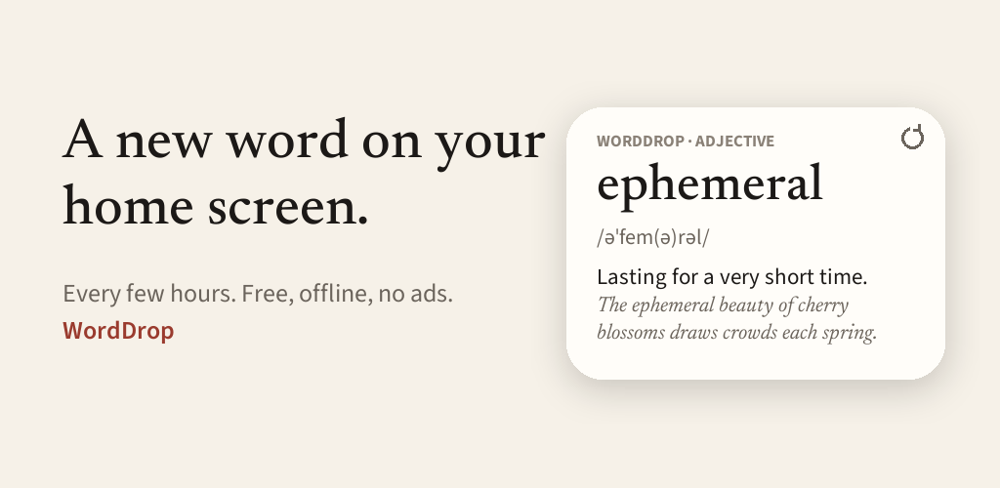
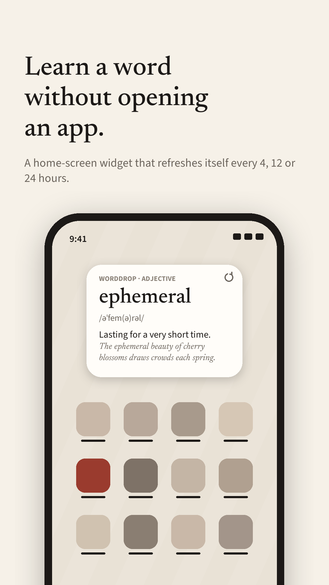
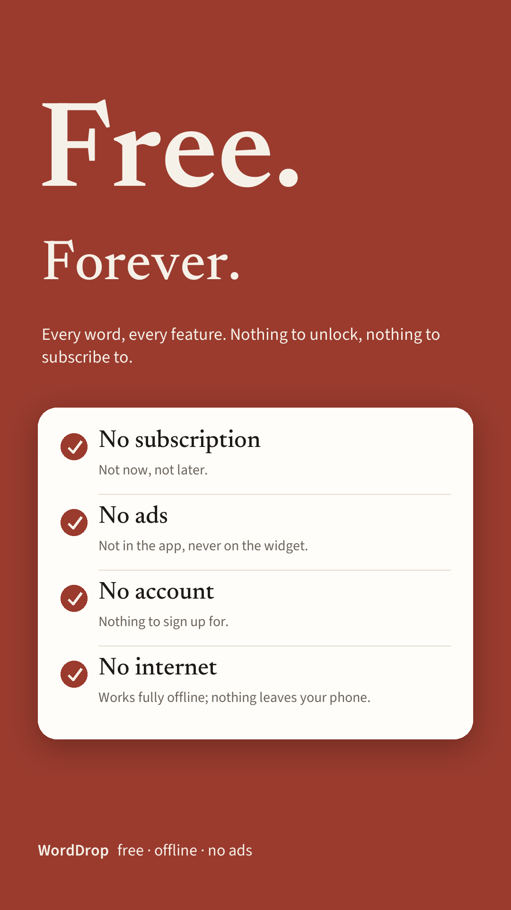
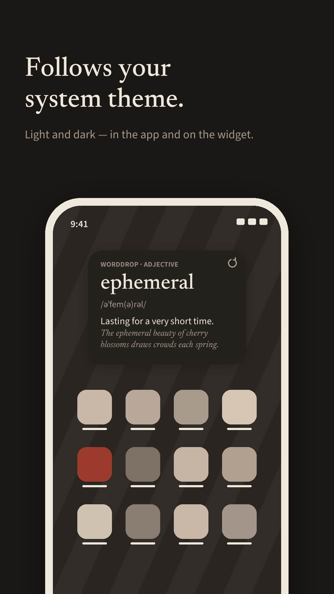
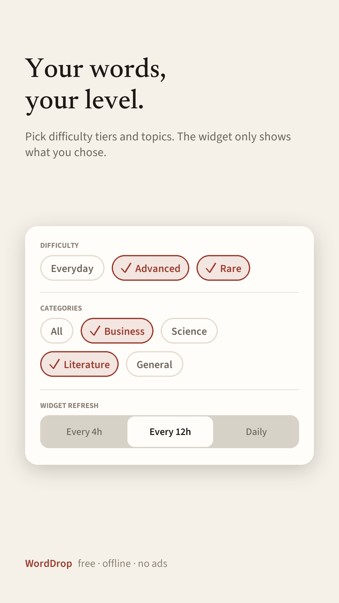
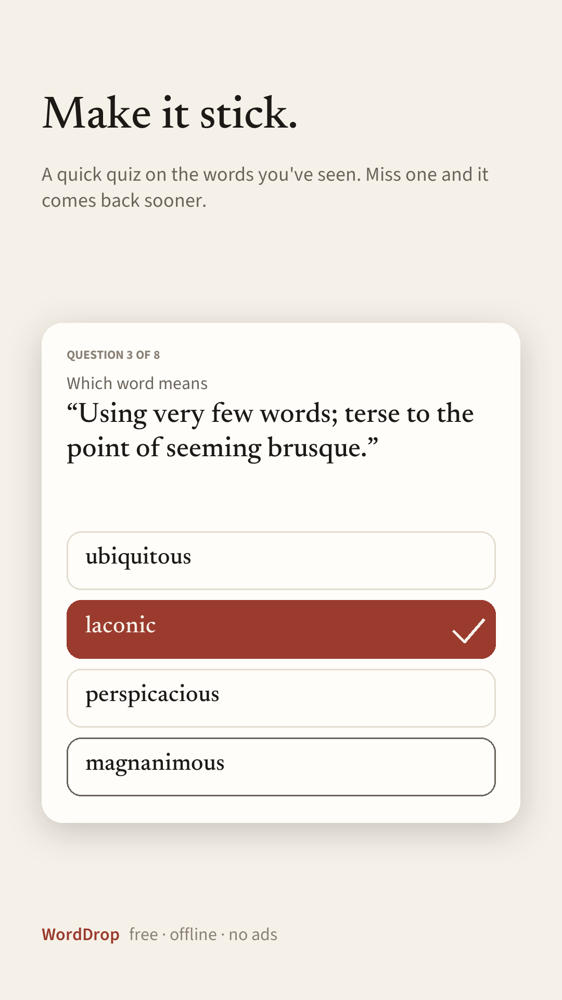
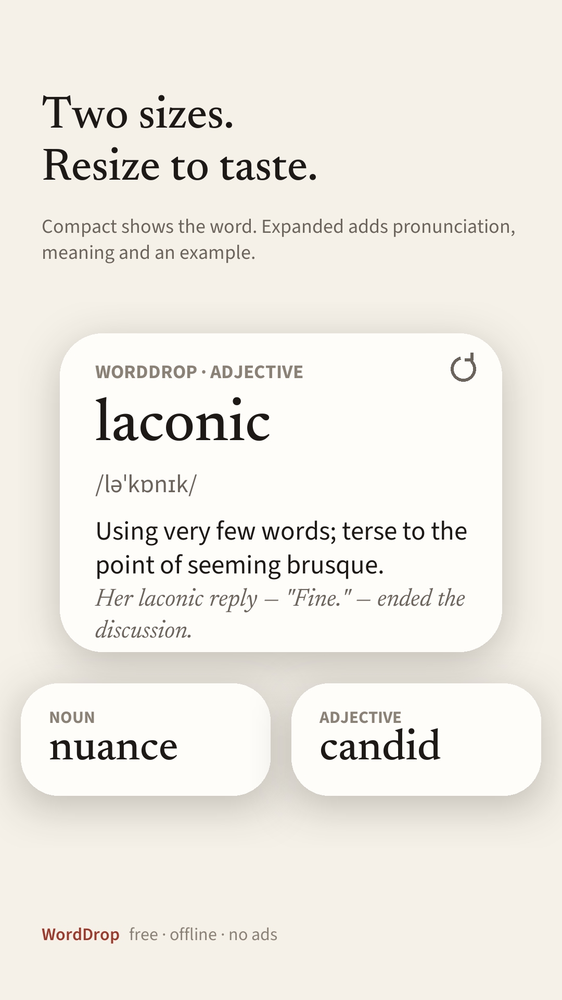
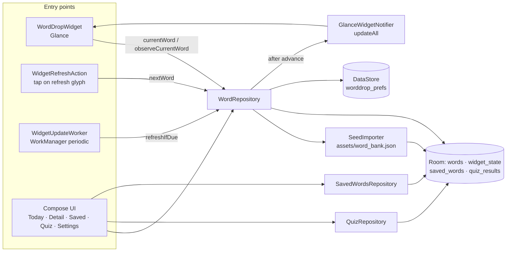

<div align="center">


# WordDrop

**A new English word on your Android home screen, refreshed on a schedule — free, offline, no ads.**

[](gradle/libs.versions.toml)
[](gradle/libs.versions.toml)
[](gradle/libs.versions.toml)
[](gradle/libs.versions.toml)
[](app/build.gradle.kts)
[](LICENSE)

[What it does](#what-it-does) · [Features](#features) · [Architecture](#architecture) · [Quick start](#quick-start) · [Word bank](#word-bank) · [Development](#development) · [Release](#release) · [Support](#support) · [License](#license)

</div>

## What it does

WordDrop is a widget-first vocabulary app. You add the widget once; every 4, 12 or 24 hours it advances to a new word with pronunciation, definition and an example sentence, without you opening anything. Tapping the widget opens the word's detail screen, where you can save it; a quiz mode later tests you on the words you have seen and saved, resurfacing the ones you got wrong.

Everything is local. The word bank ships inside the APK as JSON, is imported into Room on first launch, and the app declares no runtime permissions and no internet permission.

> [!IMPORTANT]
> **The widget and the app share one "current word" row** (`widget_state`, id `0`). The Today screen, every widget instance and the background refresh worker all read and write that single row, so they can never disagree — but it also means "Next word" anywhere advances the word everywhere.

> [!NOTE]
> Scheduled refresh runs through WorkManager with a 30-minute flex window. On phones with aggressive battery management the change may arrive late; it never shows a stale-looking or broken widget because the interval check lives in the repository, not the scheduler.

<p align="center">
  
</p>

<p align="center">
  
  
  
  
  
  
</p>

## Features

| | Feature | Detail |
|---|---|---|
| 🧩 | **Home-screen widget** | Two responsive layouts — compact 2×1 (word + part of speech) and expanded 3×2 (word, IPA, definition, example, refresh button). Built with Glance. |
| 🔁 | **Scheduled + manual refresh** | Interval of 4h / 12h / 24h chosen in Settings; the refresh glyph on the widget advances immediately. |
| 🎯 | **Difficulty & category filters** | Tiers `EVERYDAY` / `ADVANCED` / `RARE`; categories `business`, `science`, `literature` or general. At least one tier must stay on. |
| 🔀 | **No repeats until the bank cycles** | Picks randomly from the 5 least-recently-shown words; never-shown words always win, so nothing repeats until every word in the filter has been seen. |
| 💾 | **Saved words** | One-tap save from the detail screen; swipe to remove in the Saved tab. |
| 🧠 | **Quiz** | 8 multiple-choice questions (definition shown, pick the word, 4 options with same-part-of-speech distractors). Words missed in the last 14 days come first. Needs at least 4 seen or saved words. |
| 🌓 | **Light / dark** | Follows the system theme, in both the app and the widget. |
| 🔒 | **Private by construction** | No accounts, no network, no analytics. Local data is included in Android auto-backup. |

## Architecture

Single module, Hilt-injected, Room as the single source of truth. The widget, the periodic worker and the Compose UI never talk to each other — they all go through `WordRepository`.



| Concern | Where | Notes |
|---|---|---|
| Current word + no-repeat ordering | [`WordRepository.kt`](app/src/main/java/com/worddrop/app/data/repository/WordRepository.kt) | `advance()` is mutex-guarded; picks from `CANDIDATE_WINDOW = 5` least-recently-shown. |
| Widget rendering | [`WordDropWidget.kt`](app/src/main/java/com/worddrop/app/widget/WordDropWidget.kt) | `SizeMode.Responsive` with `COMPACT` 110×40dp and `EXPANDED` 180×110dp; content observes the repository flow so an in-session refresh recomposes. |
| Scheduled refresh | [`WidgetUpdateWorker.kt`](app/src/main/java/com/worddrop/app/widget/WidgetUpdateWorker.kt) | Unique periodic work `worddrop.widget.refresh`; period = user interval, flex 30 min. |
| Word bank import | [`SeedImporter.kt`](app/src/main/java/com/worddrop/app/data/seed/SeedImporter.kt) | Imports once; re-imports content (not `lastShownAt`) when `version` in the JSON is higher than the last imported. Malformed JSON throws `SeedFormatException` — never a partial bank. |
| Quiz generation | [`QuizRepository.kt`](app/src/main/java/com/worddrop/app/data/repository/QuizRepository.kt) | Missed-in-14-days first, then seen/saved shuffled. |
| Settings | [`UserPreferences.kt`](app/src/main/java/com/worddrop/app/data/prefs/UserPreferences.kt) | DataStore `worddrop_prefs`: interval, filter, seed version, battery-tip dismissed. |
| Deep link | [`WordDropNavHost.kt`](app/src/main/java/com/worddrop/app/ui/navigation/WordDropNavHost.kt) | `worddrop://word/{id}?fromWidget=true` — widget tap opens Detail; back from a widget-launched Detail finishes the activity. |

## Quick start

**Prerequisites**

- JDK 17+ (project compiles for Java 17)
- Android SDK with platform 37 installed (`compileSdk = 37`)
- An Android 8.0+ (API 26) device or emulator

No environment variables, no backend, no API keys.

```powershell
# 1. Build and install the debug APK
.\gradlew.bat :app:installDebug

# 2. Launch
adb shell am start -n com.worddrop.app/.MainActivity

# 3. Add the widget: long-press the home screen → Widgets → WordDrop
#    Resize down to 2x1 for the compact layout.

# 4. Prove the deep link works (opens the Detail screen for "ephemeral")
adb shell am start -a android.intent.action.VIEW -d "worddrop://word/ephemeral?fromWidget=true" com.worddrop.app
```

On macOS/Linux use `./gradlew` in place of `.\gradlew.bat`. A prebuilt debug APK is in [`dist/`](dist/).

> [!NOTE]
> `gradle.properties` sets `android.builtInKotlin=false` and `android.newDsl=false` to opt out of AGP 9's built-in Kotlin so the Kotlin / Compose compiler / KSP versions stay pinned together in `libs.versions.toml`. Both flags are removed in AGP 10 — migrate before upgrading.

## Word bank

The bank is [`app/src/main/assets/word_bank.json`](app/src/main/assets/word_bank.json): `{ "version": N, "words": [ … ] }` — a hand-written core plus entries generated from Wiktionary by the script below. Each word:

```json
{ "id": "ephemeral", "word": "ephemeral", "phonetic": "/əˈfem(ə)rəl/", "partOfSpeech": "adjective",
  "difficulty": "ADVANCED", "category": "literature",
  "definition": "Lasting for a very short time; transitory.",
  "example": "The ephemeral beauty of cherry blossoms draws crowds each spring.",
  "synonyms": ["fleeting", "transient"] }
```

- `id`, `word`, `definition`, `example` required and non-blank; `id` unique.
- `difficulty` ∈ `EVERYDAY | ADVANCED | RARE`. `category` is any string or `null`; categories in the file appear in Settings automatically.
- Bump `version` whenever you change the file, or existing installs will not re-import.
- The widget's fallback word `ephemeral` must stay in the bank; its tap target resolves to that id.

To grow the bank from Wiktionary (candidates from `wordfreq`, entries from kaikki.org):

```powershell
pip install -r tools/requirements.txt
python tools/build_word_bank.py --target 4000      # appends new words up to the target, bumps version
python tools/build_word_bank.py --dry-run --target 200   # preview without writing
```

What the script keeps: the word's primary sense only (never "skeleton → a very thin person"), a real usage example (editor example preferred, short modern quotation as fallback), no inflections or transparent `un-`/`non-` forms, no obsolete/slang/regional senses. Tier is assigned from `wordfreq` Zipf frequency (≥ 3.4 everyday, ≥ 2.6 advanced, else rare); category from Wiktionary topic tags. Responses are cached in `tools/.cache/` (git-ignored) so reruns are cheap. Wiktionary text is **CC BY-SA 3.0**; the credit lives in Settings → About and must stay.

<details open>
<summary><b>Data model</b></summary>

| Table | Purpose |
|---|---|
| `words` | The bank. `lastShownAt` (nullable epoch ms) drives the no-repeat cycle. |
| `widget_state` | Single row (`widgetId = 0`): `currentWordId`, `lastRefreshedAt`. |
| `saved_words` | `wordId`, `savedAt`. |
| `quiz_results` | `wordId`, `wasCorrect`, `answeredAt`. |

Room schema is exported to [`app/schemas/`](app/schemas/) — keep it committed; migrations are diffed against it.

</details>

## Development

```powershell
.\gradlew.bat :app:testDebugUnitTest     # JUnit 4 unit tests (repository logic, with fakes)
.\gradlew.bat :app:lintDebug             # Android lint; report in app/build/reports/
.\gradlew.bat :app:bundleRelease         # R8 + resource shrinking; AAB in app/build/outputs/bundle/release/
```

Unit tests live in [`app/src/test/`](app/src/test/java/com/worddrop/app/data/repository/) (`WordRepositoryTest`, `QuizRepositoryTest`). Instrumented test dependencies are declared but there are no instrumented tests yet. There is no CI configuration in the repo.

### Project structure

```
app/src/main/java/com/worddrop/app/
├── WordDropApp.kt        Hilt app; WorkManager Configuration.Provider; schedules the refresh worker
├── MainActivity.kt
├── data/
│   ├── local/            Room entities, DAOs, database, converters
│   ├── prefs/            DataStore-backed UserPreferences (interval, filter, seed version)
│   ├── repository/       WordRepository · QuizRepository · SavedWordsRepository
│   └── seed/             SeedImporter (word_bank.json → Room)
├── di/                   Hilt module
├── ui/                   Compose screens: onboarding, home (Today), detail, saved, quiz, settings
└── widget/               Glance widget, refresh action, periodic worker + scheduler
tools/build_word_bank.py  Wiktionary → word_bank.json
docs/                     PRD, technical design, Play Store prep (listing copy, privacy policy, 512px icon)
```

### Icon

Adaptive icon: [`ic_launcher_foreground.xml`](app/src/main/res/drawable/ic_launcher_foreground.xml) is the Newsreader "W" outline (ink) with a brick drop, on the paper background colour. The same drawable serves as the monochrome/themed layer. `docs/play/ic_launcher_512.png` is the Play Store rendition of the same path data.

## Release

Play Store preparation is documented in [`docs/play/`](docs/play/):

- [`release-checklist.md`](docs/play/release-checklist.md) — signing setup, build commands, what is done and what is still on you
- [`store-listing.md`](docs/play/store-listing.md) — listing copy, Data safety answers, graphic asset specs
- [`privacy-policy.md`](docs/play/privacy-policy.md)

Release signing reads an untracked `keystore.properties` (see [`keystore.properties.example`](keystore.properties.example)); without it, release builds are produced unsigned.

## Documentation

- [`docs/worddrop-prd.md`](docs/worddrop-prd.md) — product requirements
- [`docs/worddrop-technical-design.md`](docs/worddrop-technical-design.md) — technical design (the `Tech §x.y` references in code comments point here)

## Support

- **Report an issue**: [issues@avirana.com](mailto:issues@avirana.com) — include your Android version and what you tapped. In the app: Settings → Support → Report an issue (pre-fills the app version).
- **Anything else**: [hello@avirana.com](mailto:hello@avirana.com)

## License

- **Code**: [Apache License 2.0](LICENSE).
- **Word bank** (`app/src/main/assets/word_bank.json`): entries generated by `tools/build_word_bank.py` are adapted from [Wiktionary](https://en.wiktionary.org/wiki/Wiktionary:Copyrights) and are **CC BY-SA 3.0**, not Apache. Redistribution of the bank must keep the Wiktionary credit (Settings → About in the app).
- **Fonts**: Newsreader and Source Sans 3 under the SIL Open Font License — see [`app/licenses/`](app/licenses/).
